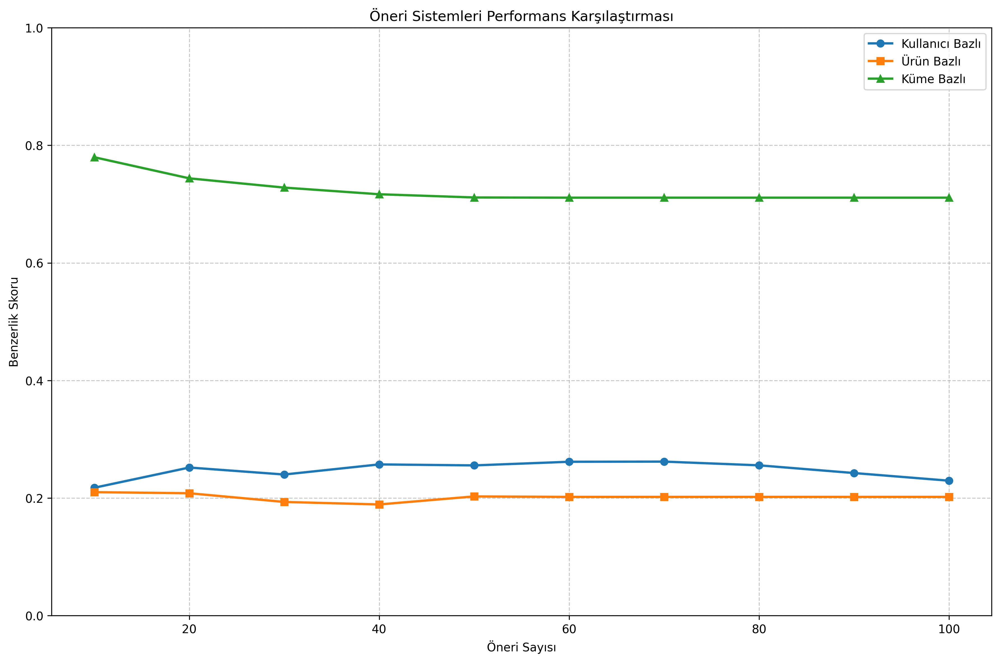

# Giyim Öneri Sistemi Dokümantasyonu 

## İçindekiler
1. [Veri Seti Mimarisi](#1-veri-setinin-genel-mimarisi-ve-kullanımı)
2. [Proje Yapısı](#2-proje-yapısı)
3. [Modeller ve Yaklaşımlar](#3-modeller-ve-yaklaşımlar)
4. [Kullanım](#4-kullanım)
5. [Teknik Detaylar](#5-teknik-detaylar)
6. [Model Performans Analizi](#6-model-performans-analizi)
7. [Örnek Çıktılar](#7-örnek-çıktılar)

## 1. Veri Setinin Genel Mimarisi ve Kullanımı

### Veri Seti Yapısı
Veri seti, kullanıcıların ve ürünlerin özelliklerini kapsayan çok boyutlu bir veri yapısından oluşmaktadır:

- **Kullanıcı Özellikleri:**
  - Yaş
  - Cinsiyet
  - Konum
  - Beden
  - Önceki alışveriş sayısı
  - Alışveriş sıklığı
  - Abonelik durumu

- **Ürün Özellikleri:**
  - Ürün adı
  - Kategori
  - Renk
  - Sezon
  - Fiyat

Bu veri yapısı, **`Customer ID`** kolonu aracılığıyla kullanıcı ve ürün bilgilerini birbirine bağlamaktadır.

### Kullanım Amacı
Veri seti, kullanıcı bazlı (önceki benzer kullanıcı davranışları), ürün bazlı (ürün özellik benzerliğine dayalı) ve hibrit kümeleme bazlı öneri sistemlerinin geliştirilmesi için kullanılmaktadır.

## 2. Proje Yapısı

### Dizin Yapısı
```
DeFacto/
├── models/                      # Öneri modelleri
│   ├── collaborative_user/      # Kullanıcı-bazlı collaborative filtering
│   ├── collaborative_item/      # Ürün-bazlı collaborative filtering
│   └── kmeans_hybrid/          # Hibrit kümeleme modeli
├── common/                      # Ortak kullanılan modüller
│   ├── data_preprocessing.py    # Veri ön işleme
│   ├── evaluation.py           # Model değerlendirme
│   └── utils.py                # Yardımcı fonksiyonlar
├── src/                        # Ana program
│   └── main.py                 # Ana program dosyası
├── data/                       # Veri setleri
├── results/                    # Model sonuçları
└── tests/                      # Test dosyaları
```

### Veri İşleme Aşamaları
- Veri seti kullanıcı ve ürün özelliklerine göre ikiye ayrılır
- Kategorik veriler için one-hot encoding
- Sayısal veriler için MinMaxScaler ile normalizasyon
- Özel kodlamalar (beden, alışveriş sıklığı) için manual mapping

## 3. Modeller ve Yaklaşımlar

### 3.1. Collaborative User-Based Model
- **Dizin**: `models/collaborative_user/`
- **Yaklaşım**: Kullanıcılar arası benzerlikleri kullanarak öneriler sunar
- **Temel Metrik**: Kosinüs benzerliği
- **Özellikler**:
  - Kullanıcı özelliklerinin vektörel temsili
  - En benzer N kullanıcının ürünlerinin önerilmesi
  - Benzerlik skoruna dayalı filtreleme

### 3.2. Collaborative Item-Based Model
- **Dizin**: `models/collaborative_item/`
- **Yaklaşım**: Ürünler arası benzerlikleri kullanarak öneriler sunar
- **Temel Metrik**: Kosinüs benzerliği
- **Özellikler**:
  - Ürün özelliklerinin vektörel temsili
  - Kullanıcının mevcut ürününe benzer ürünlerin önerilmesi
  - Kategori ve fiyat bazlı filtreleme

### 3.3. KMeans Hybrid Model
- **Dizin**: `models/kmeans_hybrid/`
- **Yaklaşım**: Hem kullanıcıları hem ürünleri kümeleyerek hibrit öneriler sunar
- **Özellikler**:
  - Otomatik küme sayısı optimizasyonu (Elbow metodu)
  - Çok boyutlu benzerlik skorlama
  - Detaylı küme analizleri
  - Ağırlıklı benzerlik metrikleri:
    - Ürün kümesi benzerliği (0.4)
    - Kategori benzerliği (0.2)
    - Sezon benzerliği (0.15)
    - Kullanıcı kümesi benzerliği (0.15)
    - Fiyat benzerliği (0.05)
    - Renk benzerliği (0.05)

## 4. Kullanım

### 4.1. Kurulum
```bash
make setup
```

### 4.2. Model Çalıştırma
```bash
# Kullanıcı-bazlı öneriler
make collaborative_user USER_ID=123

# Ürün-bazlı öneriler
make collaborative_item USER_ID=123

# Küme-bazlı öneriler
make kmeans_hybrid USER_ID=123
```

### 4.3. Model Değerlendirme
```bash
make evaluate N_TEST_USERS=100
```

## 5. Teknik Detaylar

### 5.1. Veri Ön İşleme

#### MinMaxScaler ile Normalizasyon
- Age
- Previous Purchases

#### One-Hot Encoding
- Gender
- Location
- Color
- Category
- Season

#### Özel Kodlamalar
- Size: `{'S': 0, 'M': 1, 'L': 2, 'XL': 3}`
- Frequency: `{'Rarely': 0, 'Occasionally': 1, 'Monthly': 2, 'Weekly': 3, 'Often': 4}`

### 5.2. Model Özellikleri

#### Kullanıcı Kümeleme Özellikleri
```python
user_features = [
    'Age',                    # Sayısal
    'Gender',                 # Kategorik
    'Previous Purchases',     # Sayısal
    'Frequency of Purchases', # Özel kodlama
    'Size',                   # Özel kodlama
    'Subscription Status'     # Kategorik
]
```

#### Ürün Kümeleme Özellikleri
```python
item_features = [
    'Item Purchased',  # Kategorik
    'Category',        # Kategorik
    'Season'          # Kategorik
]
```

## 6. Model Performans Analizi

### Değerlendirme Sonuçları



### Model Bazlı Analiz

1. **KMeans Hybrid Model (Yeşil):**
   - En tutarlı ve yüksek performans
   - Farklı öneri sayılarında ~1.0 civarında stabil başarı oranı
   - Çok boyutlu analiz yaklaşımının olumlu etkisi

2. **Item-Based Model (Turuncu):**
   - İkinci en iyi performans
   - Öneri sayısı arttıkça hafif performans düşüşü
   - Ürün özellikleri arasındaki benzerliğin etkili olduğunu gösteriyor

3. **User-Based Model (Mavi):**
   - En düşük performans
   - Kullanıcı özelliklerinin tek başına yeterli olmadığını işaret ediyor

### İyileştirme Önerileri
1. Kullanıcı bazlı modelde özellik seçimi geliştirilebilir
2. Farklı kümeleme algoritmaları test edilebilir
3. Neural Collaborative Filtering gibi derin öğrenme yaklaşımları eklenebilir

## 7. Örnek Çıktılar

### Kullanıcı Bazlı Öneri Örneği
```
==================================================
HEDEF BİLGİLERİ:

Kullanıcı Bilgileri:
  - Yaş: 40
  - Cinsiyet: Male
  - Konum: Washington
  - Beden: L
  - Önceki Alışverişler: 44
  - Alışveriş Sıklığı: Fortnightly
==================================================

==================================================
KULLANICI BAZLI ÖNERİLER:

==================== Öneri 1 ====================
Ürün Bilgileri:
  - İsim: T-shirt
  - Kategori: Clothing
  - Renk: Purple
  - Sezon: Fall
  - Fiyat: $31.00
  - Benzerlik Skoru: 0.9979

Kullanıcı Bilgileri:
  - Yaş: 36
  - Cinsiyet: Male
  - Konum: Washington
  - Beden: L
  - Önceki Alışverişler: 35
  - Alışveriş Sıklığı: Every 3 Months
```

### Küme Bazlı Öneri Örneği
```
Küme Analizi Sonuçları:
==================================================

Kullanıcı Kümeleri:

Küme 0:
  - Küme Büyüklüğü: 2808 kullanıcı
  - Ortalama Yaş: 43.9
  - Baskın Cinsiyet: Male
  - Ortalama Alışveriş: 25.3

Ürün Kümeleri:

Küme 0:
  - Küme Büyüklüğü: 842 ürün
  - Baskın Kategori: Footwear
  - Baskın Sezon: Summer
  - Ortalama Fiyat: $59.61
```

### Ürün Bazlı Öneri Örneği
```
==================================================
HEDEF BİLGİLERİ:

==================================================
Ürün Bilgileri:
  - İsim: Backpack
  - Kategori: Accessories
  - Renk: Brown
  - Sezon: Spring
  - Fiyat: $0.00
==================================================

==================================================
ÜRÜN BAZLI ÖNERİLER:

==================== Öneri 1 ====================
Ürün Bilgileri:
  - İsim: Gloves
  - Kategori: Accessories
  - Renk: Brown
  - Sezon: Spring
  - Fiyat: $45.00
  - Benzerlik Skoru: 0.7500
```